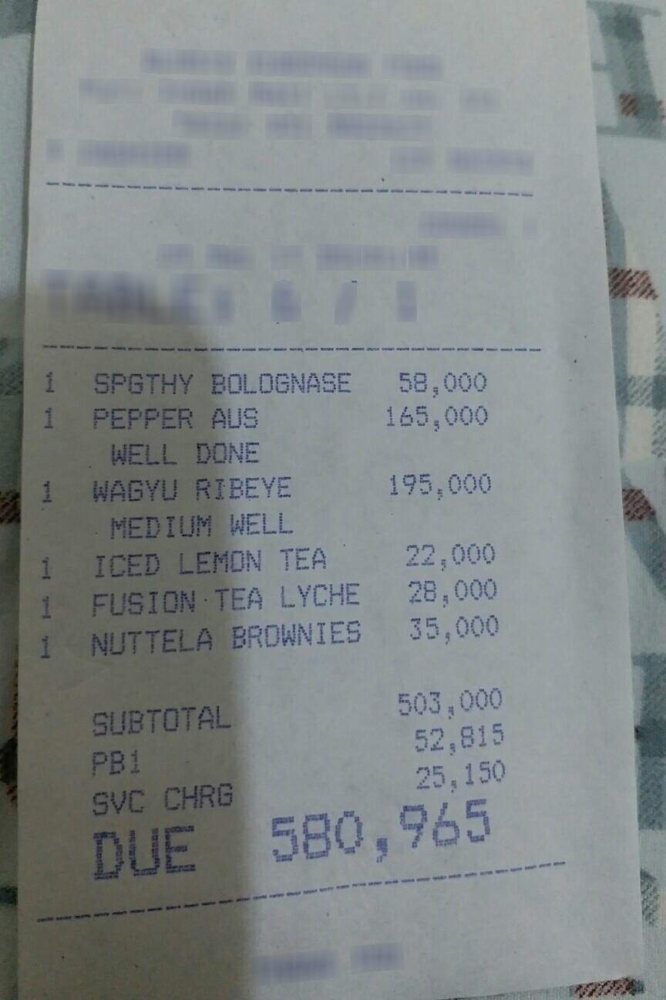

# DocXtract-LoRA

LoRA fine-tuning of [`naver-clova-ix/donut-base`](https://huggingface.co/naver-clova-ix/donut-base) — a small, OCR-free document-understanding vision-language model — for structured field extraction from receipts, using the [CORD-v2](https://huggingface.co/datasets/naver-clova-ix/cord-v2) dataset. Given a photo of a receipt, the model outputs structured JSON (line items, quantities, prices, subtotal, tax, total) directly from pixels, with no separate OCR step. This project trains a LoRA adapter that teaches the pretrained-only base model a task it has never seen, measures the real before/after difference on a held-out test set, and is honest about what a few hundred training examples on a single laptop GPU can and can't achieve.

## Results at a glance

| Metric | Baseline (`donut-base`) | Fine-tuned (+ LoRA) | Change |
|---|---|---|---|
| Micro-F1 (field-level) | 0.0% | 11.0% | +11.0% |
| Macro-F1 (per-example mean) | 0.0% | 13.4% | +13.4% |
| Micro-precision | 0.0% | 18.9% | +18.9% |
| Micro-recall | 0.0% | 7.8% | +7.8% |

Evaluated on the same 100-example held-out CORD-v2 test subset for both models. Baseline correctly extracted 0/1301 ground-truth fields; the fine-tuned model correctly extracted 101/1301. Full breakdown and discussion in [`results/comparison.md`](results/comparison.md).

**Why the baseline is exactly 0%, not just low:** `donut-base` is *pretrained only* — never fine-tuned on any downstream task — so its tokenizer literally doesn't contain CORD's field vocabulary (`<s_menu>`, `<s_total_price>`, ...). It emits an end-of-sequence token immediately and produces no structured output at all. That's the genuine pre-fine-tuning state, not a broken eval (see `results/baseline_metrics.json` for raw examples).

## Example output

<table>
<tr><td></td><td>

```json
{
  "menu": [
    {"cnt": "1", "nm": "SPGTHY BOL OGNASE", "price": "58,000"},
    {"price": "22.000"},
    {"nm": "PEPPER AUS"}
  ],
  "subtotal_price": "22.000"
}
```

Ground truth's first menu item is `{"nm": "SPGTHY BOLOGNASE", "cnt": "1", "price": "58,000"}` — the model got the quantity and price exactly right and the name nearly right (`BOL OGNASE` vs `BOLOGNASE`, a tokenization split). It then loses track of the remaining 5 menu items and the full totals block. This is representative of the model's actual current skill level: it has learned the *shape* of a receipt and the first item reliably, not full-document extraction.
</td></tr>
</table>

Run `python src/infer.py results/sample_1_image.png` to reproduce this yourself.

## Setup

```bash
python -m venv .venv
# Windows:
.venv\Scripts\activate
# macOS/Linux:
source .venv/bin/activate

# Install PyTorch with CUDA support first (adjust the index URL for your CUDA version;
# this project was built and tested against CUDA 12.4 on an RTX 3050 6GB laptop GPU):
pip install torch==2.6.0 --index-url https://download.pytorch.org/whl/cu124

pip install -r requirements.txt
```

CPU-only works for data exploration and evaluation of small batches, but LoRA training is impractical without a GPU (see [Limitations](#limitations)).

## Reproduce end-to-end

```bash
# 1. Explore the data (saves a few sample images + ground truth to /results)
python data/explore_data.py

# 2. Baseline evaluation (pre-fine-tuning) — ~25s on a GPU
python src/evaluate.py

# 3. LoRA fine-tuning — ~6 minutes on an RTX 3050 6GB
python src/train.py

# 4. Post-fine-tuning evaluation on the same held-out test set — ~2 min
python src/evaluate.py --adapter_path checkpoints/lora-cord-v2 --output results/finetuned_metrics.json

# 5. Regenerate the before/after comparison table
python src/compare_results.py

# 6. Run inference on a single receipt image
python src/infer.py path/to/receipt.jpg
```

All scripts are run from the project root. `checkpoints/` is gitignored (LoRA adapter weights, ~470MB) — re-run `src/train.py` to regenerate it; everything under `results/` in this repo is real, versioned output from an actual run.

## How it works

- **Data**: CORD-v2 (800 train / 100 val / 100 test full-size). To keep training under an hour on a single 6GB-VRAM laptop GPU, this project uses a fixed-seed subset: 200 train / 50 val / 100 test (full test split, since it's already small). See `data/explore_data.py` for the reasoning and `src/cord_utils.py::SUBSET_SIZES`.
- **Vocabulary extension**: `donut-base` has never seen CORD's field tokens, so `src/train.py` scans the train subset, discovers every field key (`menu`, `nm`, `cnt`, `price`, `sub_total`, `total_price`, ...), adds `<s_key>`/`</s_key>` tokens plus a task start/end token, and resizes the decoder's embedding table + tied output head to match.
- **What gets LoRA-adapted vs. fully trained**: the decoder's attention projections (`q_proj`/`k_proj`/`v_proj`/`out_proj`) get a LoRA adapter (r=8, alpha=16) — this is the actual "LoRA" part, small and cheap. The newly-resized embedding table and output head are marked fully trainable via `peft`'s `modules_to_save`, since LoRA on attention projections alone can't teach the model to *emit* brand-new vocabulary it has zero embedding for. The pretrained Swin vision encoder is left completely frozen — this task is about learning CORD's output structure, not new visual features. See the module-selection rationale in `src/cord_utils.py`.
- **Training**: bf16 mixed precision (native hardware support on this Ampere GPU, no `GradScaler` needed), batch size 1 with gradient accumulation 4 (effective batch 4), 6 epochs over 200 examples, ~6 minutes wall-clock, peak VRAM ~3.3GB.
- **Evaluation metric**: field-level precision/recall/F1 over the flattened ground-truth structure (`src/cord_utils.py::field_level_accuracy`) — a predicted field only counts as correct if both its key path and its (normalized) value match. This is a strict, literal metric; it doesn't give partial credit for "close" numeric OCR errors.

## Limitations

This is a small-scale, honest portfolio result, not a production-grade extractor:

- **Small training set**: 200 examples (25% of CORD-v2's train split), chosen to keep iteration fast on a single laptop GPU. More data would very likely improve results further — training loss and validation loss were both still decreasing at epoch 6 (0.92), not yet converged.
- **Reduced image resolution**: inputs are downscaled to 960×720 (vs. `donut-base`'s native 2560×1920, and smaller than the original Donut paper's 1280×960 CORD setting) to fit training in 6GB VRAM. This directly costs legibility on small print — many of the fine-tuned model's errors are digit/character misreads consistent with this.
- **Few epochs, no hyperparameter search**: 6 epochs at a single learning rate (1e-4), chosen pragmatically rather than tuned. No learning-rate schedule, no early stopping, no LoRA rank/target-module sweep.
- **Strict exact-match metric**: field values must match exactly after normalization, so a correctly-identified `total_price` off by one OCR'd digit scores as fully wrong. Real-world usefulness is likely somewhat understated by the raw F1 number for this reason.
- **Single random seed**: dataset subsetting and training used one fixed seed throughout; no variance estimate across multiple runs.
- **CPU is not a practical fallback for training**: this ~200M-parameter vision-language model's training loop was only run and measured on GPU (RTX 3050 laptop, 6GB VRAM). See `src/train.py`, which deliberately exits early with an explanation if no CUDA GPU is detected rather than attempting an unrealistically slow CPU run.

## Project structure

```
data/           dataset loading/exploration (data/explore_data.py)
src/
  cord_utils.py     shared dataset, model-loading, and metric utilities
  train.py          LoRA fine-tuning
  evaluate.py       baseline / fine-tuned evaluation (dual-mode)
  compare_results.py   generates results/comparison.md from the two metrics files
  infer.py          single-image inference demo
results/        metrics JSON, loss curve, comparison table, sample images
checkpoints/    LoRA adapter weights (gitignored — regenerate via src/train.py)
```
